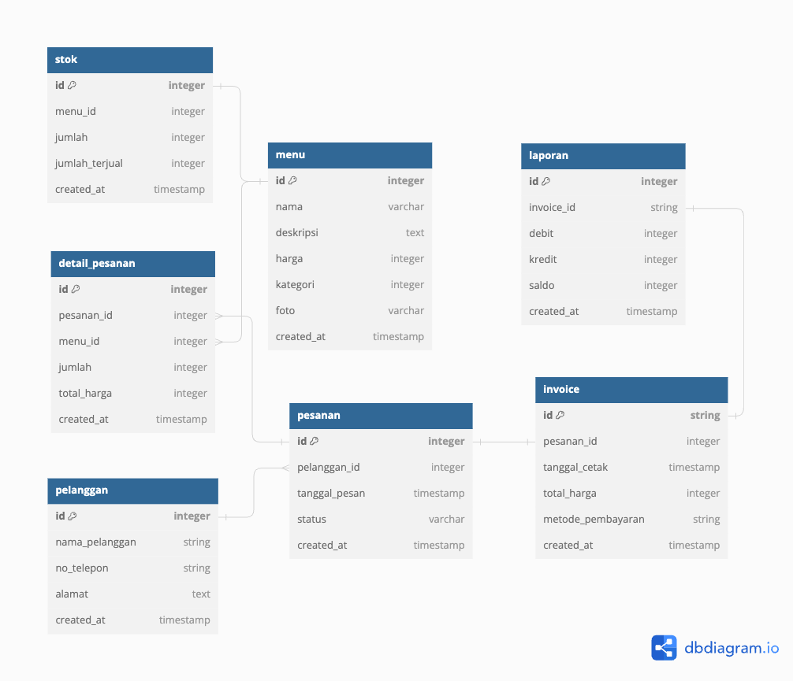

# Soal No 1

## Desain Database Aplikasi Rumah Makan



## Teknologi yang Dipilih dan Alasannya:

**Backend**

Go: alasan memilih Go sebagai bahasa pemrograman untuk backend karena Go memiliki performa yang sangat baik, dalam hal pengelolaan memori yang lebih efisien dan juga bisa menjalankan concurrency, jadi mempermudah untuk scale up jika di butuhkan pengembangan pada aplikasinya

**Frontend**

React: alasan memilih react dikarenakan memiliki struktur unopinionated sehingga bisa mengikuti style code yang ditentukan tim dan react juga memiki library componen css khusus seperti [chakra-ui.com](http://chakra-ui.com) dan [ui.shadcn.com](http://ui.shadcn.com/) sehingga memudahkan untuk development aplikasi di awal

**Database**

PostgreSQL: alasan memilih postgresSQL yaitu kemampuannya dalam menyimpan data JSON yang berguna untuk menyimpan data tambahan seperti deskripsi menu atau foto menu aplikasi rumah makan tersebut

**ORM**

GORM: alasan memilih GORM dikarenakan dukungan dari orm itu sendiri yang bisa berinteraksi dengan database PostgreSQL menggunakan objek dan query dari bahasa pemrograman tersebut sehingga dengan harapan ketika menggunakan gorm bisa mempercepat development walaupun mengorbankan sedikit performa querrynya nanti

**Server Web**

Nginx: alasan memilih nginx sebagai server web adalah penggunaan memori yang kecil dengan konkurensi yang ditinggi. Ditambah, Nginx memiliki arsitektur *asynchronous* dan pendekatan *event-driven*, membuat Nginx tidak perlu membuat suatu proses baru jika terdapat *web request.*

**Keamanan:**

JWT: karena aplikasi kita sangat konfidensialitas berkaitan dengan transaksi dan juga uang rumah makan sehingga kita perlu mengimplementasikan otentikasi dan otorisasi dengan JWT untuk melindungi API backend agar tidak mudah di retas

**Kontainerisasi**

Docker: dikarenakan aplikasi di buat dalam bentuk microservice sehingga di butuhkan kontainer untuk mempermudah proses setup maupun deployment ke server

**CI/CD**

Github Action: karena aplikasi rumah makan ingin melakukan efesiensi dalam melakukan proses deployment ke server kita harus menerapkan CI/CD untuk menjalankan unit test dan lint sebelum masuk ke server agar terhidar bug ketika di production

# Soal No 2 dan Penjelasan Kode

## Ringkasan

Potongan kode ini adalah bagian dari program yang lebih besar yang mensimulasikan permainan dadu. Program ini membutuhkan input untuk jumlah pemain dan jumlah dadu, dan kemudian melanjutkan untuk mensimulasikan putaran permainan. Setiap pemain memulai dengan jumlah dadu yang sama. Di setiap ronde, para pemain bergiliran melempar dadu. Jika seorang pemain melempar dadu angka 1, maka ia akan kehilangan dadu tersebut dan memberikannya kepada pemain berikutnya. Permainan berlanjut hingga hanya satu pemain yang memiliki dadu yang tersisa, dan pemain tersebut dinyatakan sebagai pemenang.

## Contoh Penggunaan

```go
Masukkan jumlah pemain: 4
Masukkan jumlah dadu: 3

==================
Giliran 1 lempar dadu:
Pemain #1 (3): [2 4 6]
Setelah evaluasi:
Pemain #1 (3): [2 4 6]
Pemain #2 (3): [1 3 5]
Setelah evaluasi:
Pemain #2 (2): [3 5]
Pemain #3 (3): [1 2 4]
Setelah evaluasi:
Pemain #3 (2): [2 4]
Pemain #4 (3): [1 3 6]
Setelah evaluasi:
Pemain #4 (2): [3 6]

==================
Giliran 2 lempar dadu:
Pemain #1 (3): [1 2 5]
Setelah evaluasi:
Pemain #1 (2): [2 5]
Pemain #2 (2): [3 4]
Setelah evaluasi:
Pemain #2 (2): [3 4]
Pemain #3 (2): [2 3]
Setelah evaluasi:
Pemain #3 (2): [2 3]
Pemain #4 (2): [2 4]
Setelah evaluasi:
Pemain #4 (2): [2 4]

==================
Giliran 3 lempar dadu:
Pemain #1 (2): [2 4]
Setelah evaluasi:
Pemain #1 (2): [2 4]
Pemain #2 (2): [3 4]
Setelah evaluasi:
Pemain #2 (2): [3 4]
Pemain #3 (2): [2 3]
Setelah evaluasi:
Pemain #3 (2): [2 3]
Pemain #4 (2): [2 4]
Setelah evaluasi:
Pemain #4 (2): [2 4]

==================
Giliran 4 lempar dadu:
Pemain #1 (2): [2 4]
Setelah evaluasi:
Pemain #1 (2): [2 4]
Pemain #2 (2): [3 4]
Setelah evaluasi:
Pemain #2 (2): [3 4]
Pemain #3 (2): [2 3]
Setelah evaluasi:
Pemain #3 (2): [2 3]
Pemain #4 (2): [2 4]
Setelah evaluasi:
Pemain #4 (2): [2 4]

==================
Giliran 5 lempar dadu:
Pemain #1 (2): [2 4]
Setelah evaluasi:
Pemain #1 (2): [2 4]
Pemain #2 (2): [3 4]
Setelah evaluasi:
Pemain #2 (2): [3 4]
Pemain #3 (2): [2 3]
Setelah evaluasi:
Pemain #3 (2): [2 3]
Pemain #4 (2): [2 4]
Setelah evaluasi:
Pemain #4 (2): [2 4]

==================
Giliran 6 lempar dadu:
Pemain #1 (2): [2 4]
Setelah evaluasi:
Pemain #1 (2): [2 4]
Pemain #2 (2): [3 4]
Setelah evaluasi:
Pemain #2 (2): [3 4]
Pemain #3 (2): [2 3]
Setelah evaluasi:
Pemain #3 (2): [2 3]
Pemain #4 (2): [2 4]
Setelah evaluasi:
Pemain #4 (2): [2 4]

==================
Giliran 7 lempar dadu:
Pemain #1 (2): [2 4]
Setelah evaluasi:
Pemain #1 (2): [2 4]
Pemain #2 (2): [3 4]
Setelah evaluasi:
Pemain #2 (2): [3 4]
Pemain #3 (2): [2 3]
Setelah evaluasi:
Pemain #3 (2): [2 3]
Pemain #4 (2): [2 4]
Setelah evaluasi:
Pemain #4 (2): [2 4]

==================
Giliran 8 lempar dadu:
Pemain #1 (2): [2 4]
Setelah evaluasi:
Pemain #1 (2): [2 4]
Pemain #2 (2): [3 4]
Setelah evaluasi:
Pemain #2 (2): [3 4]
Pemain #3 (2): [2 3]
Setelah evaluasi:
Pemain #3 (2): [2 3]
Pemain #4 (2): [2 4]
Setelah evaluasi:
Pemain #4 (2): [2 4]

==================
Giliran 9 lempar dadu:
Pemain #1 (2): [2 4]
Setelah evaluasi:
Pemain #1 (2): [2 4]
Pemain #2 (2): [3 4]
Setelah evaluasi:
Pemain #2 (2): [3 4]
Pemain #3 (2): [2 3]
Setelah evaluasi:
Pemain #3 (2): [2 3]
Pemain #4 (2): [2 4]
Setelah evaluasi:
Pemain #4 (2): [2 4]

==================
Giliran 10 lempar dadu:
Pemain #1 (2): [2 4]
Setelah evaluasi:
Pemain #1 (2): [2 4]
Pemain #2 (2): [3 4]
Setelah evaluasi:
Pemain #2 (2): [3 4]
Pemain #3 (2): [2 3]
Setelah evaluasi:
Pemain #3 (2): [2 3]
Pemain #4 (2): [2 4]
Setelah evaluasi:
Pemain #4 (2): [2 4]

Permainan berakhir karena hanya pemain #1 yang memiliki dadu.
Permainan dimenangkan oleh pemain #1 karena memiliki poin lebih banyak dari pemain lainnya.
```

## Analisis Kode

### Masukan

- Jumlah pemain (N)
- Jumlah dadu yang dimiliki setiap pemain (M)

---

### Alur

1. Kode meminta pengguna untuk memasukkan jumlah pemain dan jumlah dadu.
2. Kode ini menciptakan sebuah irisan yang disebut 'pemain' dengan panjang N, di mana setiap elemennya merepresentasikan jumlah dadu untuk seorang pemain.
3. Kode ini memasuki sebuah perulangan yang mensimulasikan putaran permainan.
4. Di setiap putaran, kode ini mencetak nomor putaran dan lemparan dadu pemain saat ini.
5. Kode ini mengevaluasi lemparan dadu dan memperbarui jumlah dadu untuk setiap pemain berdasarkan aturan permainan.
6. Setelah mengevaluasi lemparan dadu, ia mencetak jumlah dadu yang diperbarui untuk setiap pemain.
7. Ini memeriksa apakah hanya ada satu pemain yang tersisa dengan dadu. Jika demikian, maka pemain tersebut dinyatakan sebagai pemenang dan mengakhiri permainan.
8. Jika masih ada beberapa pemain yang memiliki dadu, kode akan menambah jumlah putaran dan melanjutkan ke putaran berikutnya.

---

### Output

- Permainan berlanjut dengan setiap pemain bergiliran melempar dadu.
- Kode mencetak lemparan dadu untuk setiap pemain di setiap ronde.
- Setelah mengevaluasi lemparan dadu, kode akan mencetak jumlah dadu yang diperbarui untuk setiap pemain.
- Jika hanya ada satu pemain yang tersisa dengan dadu, kode menyatakan pemain tersebut sebagai pemenang dan mengakhiri permainan.

---
